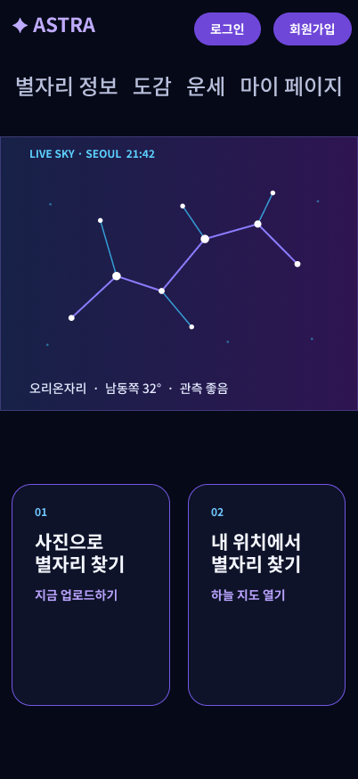

# ASTRA - 별자리 인식 서비스

스마트폰으로 촬영한 밤하늘 사진에서 별 후보를 찾고, 천문 좌표로 결과를 검증해 별자리 정보와 관측 결과를 제공하는 팀 프로젝트입니다.



## 프로젝트 정보

- 기간: 2026.08.24 - 2026.09.18
- 형태: 4인 팀 프로젝트
- 담당: YOLO11n 학습 및 평가, WCS 검증, AWS EC2·Docker 배포, 화면 세부 수정

## 주요 기능

- 밤하늘 이미지 업로드와 별자리 인식 결과 표시
- DoG 기반 별 후보 검출과 Delaunay 구조 매칭
- Astrometry.net Plate Solving과 WCS 좌표 변환
- Gaia·HYG 카탈로그를 이용한 인식 결과 검증
- YOLO11n 기반 주요 천체 객체 검출
- 회원, 별자리 도감, 관측 정보, 오늘의 운세 기능

## 인식 흐름

```text
이미지 업로드
  → 별 후보 검출
  → 별 구조 매칭
  → Plate Solving
  → WCS 좌표 변환
  → Gaia·HYG 검증
  → 별자리 선과 정보 표시
```

## 기술 스택

| 구분 | 기술 |
|---|---|
| Front | React, Vite, Styled Components |
| Back | Python, FastAPI, SQLAlchemy |
| AI·CV | YOLO11n, OpenCV, Astropy, Astrometry.net, Gaia, HYG |
| DB | MySQL |
| Infra | AWS EC2, Docker, Nginx |
| Tool | Git, GitHub, VS Code, MySQL Workbench |

## 프로젝트 구조

```text
front/          React 사용자 화면
server/         FastAPI API, 회원·별자리·결제·운세 기능
Constellation/  데이터 수집, 영상처리, WCS 검증, YOLO 학습·평가
deploy/         모델, Astrometry.net 인덱스, WCS 캐시
```

AI 데이터 준비와 평가 과정은 [Constellation 상세 README](Constellation/README.md)에서 확인할 수 있습니다.

## 실행 방법

### Frontend

```bash
cd front
npm install
npm run dev
```

### Backend

```bash
cd server
python -m venv .venv
.venv\Scripts\activate
pip install -r requirements.txt
uvicorn main:app --reload --port 8000
```

### Docker

환경변수와 모델 파일을 준비한 뒤 저장소 루트에서 실행합니다.

```bash
docker compose up --build -d
```

> API 키, 데이터베이스 비밀번호, 원본 학습 데이터와 모델 가중치는 저장소에 포함하지 않습니다.
